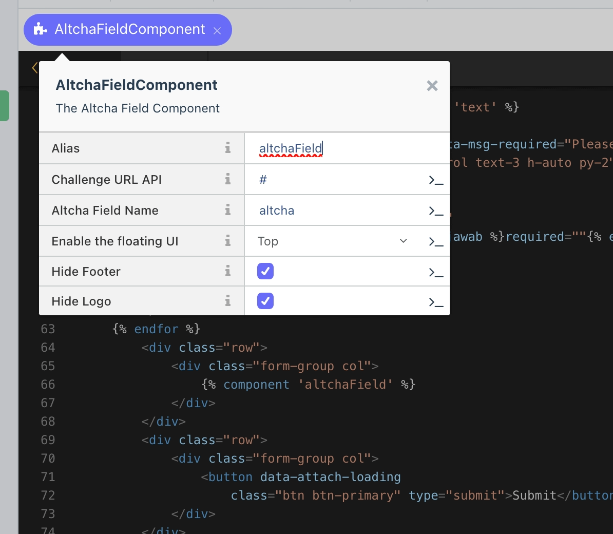

# Altcha

This is the implementation of [Altcha](https://altcha.org/) for OctoberCMS, provided as a plugin that you can use in your project.

## Installation

Currently, this plugin is only available via cloning from GitHub.

1. Navigate to your plugins directory:
   ```
   $ cd your_plugins_path
   ```

2. Create a directory named `yfktn`:
   ```
   $ mkdir yfktn
   ```

3. Navigate into the `yfktn` directory:
   ```
   $ cd yfktn
   ```

4. Clone the repository:
   ```
   $ git clone https://github.com/yfktn/altcha-oc altcha
   ```

After cloning, you need to run the `october:migrate` command to apply the migration scripts for this plugin.

```
$ cd your_project_root
$ php artisan october:migrate
```
## How To Use

### Add AltchaField Component

In your form, simply add the AltchaField Component. 



### Use the Validator

In your submit action method, you need to execute AltchaField validator to validate the request.

```php
$captchaFieldName = post('captcha-field-name');
$isRecaptchaFails = true;
if($enableCaptcha) {
   // Check for spam?
   $recaptchaValidator = Validator::make(post(), [
         $captchaFieldName => ['required', new \Yfktn\Altcha\Classes\AltchaValidator($captchaFieldName)],
   ]); 
   $isRecaptchaFails = $recaptchaValidator->fails();
}
```
